# WRFCoin Component Interaction Diagrams

## Overview

This document provides detailed component interaction diagrams for the WRFCoin API & backend
integration architecture, illustrating how the various microservices, GraphQL layer, and data
systems interact to provide a cohesive platform experience.

## GraphQL to Microservices Integration

### Token Resolution Flow

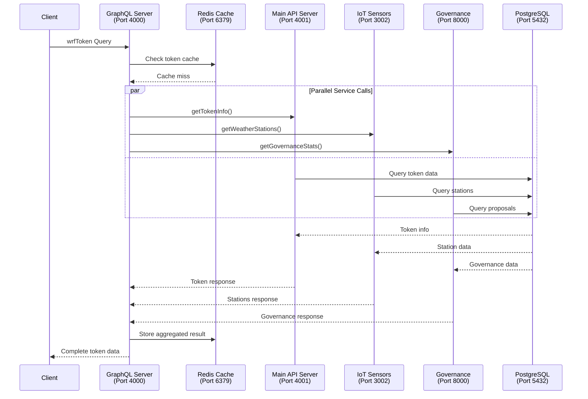
```mermaid
sequenceDiagram
    participant Client
    participant GraphQL as GraphQL Server<br/>(Port 4000)
    participant Cache as Redis Cache<br/>(Port 6379)
    participant Blockchain as Main API Server<br/>(Port 4001)
    participant Weather as IoT Sensors<br/>(Port 3002)
    participant Gov as Governance<br/>(Port 8000)
    participant DB as PostgreSQL<br/>(Port 5432)

    Client->>GraphQL: wrfToken Query
    GraphQL->>Cache: Check token cache
    Cache-->>GraphQL: Cache miss

    par Parallel Service Calls
        GraphQL->>Blockchain: getTokenInfo()
        GraphQL->>Weather: getWeatherStations()
        GraphQL->>Gov: getGovernanceStats()
    and
        Blockchain->>DB: Query token data
        Weather->>DB: Query stations
        Gov->>DB: Query proposals
    end

    DB-->>Blockchain: Token info
    DB-->>Weather: Station data
    DB-->>Gov: Governance data

    Blockchain-->>GraphQL: Token response
    Weather-->>GraphQL: Stations response
    Gov-->>GraphQL: Governance response

    GraphQL->>Cache: Store aggregated result
    GraphQL-->>Client: Complete token data
```

### Error Handling & Circuit Breaker Flow

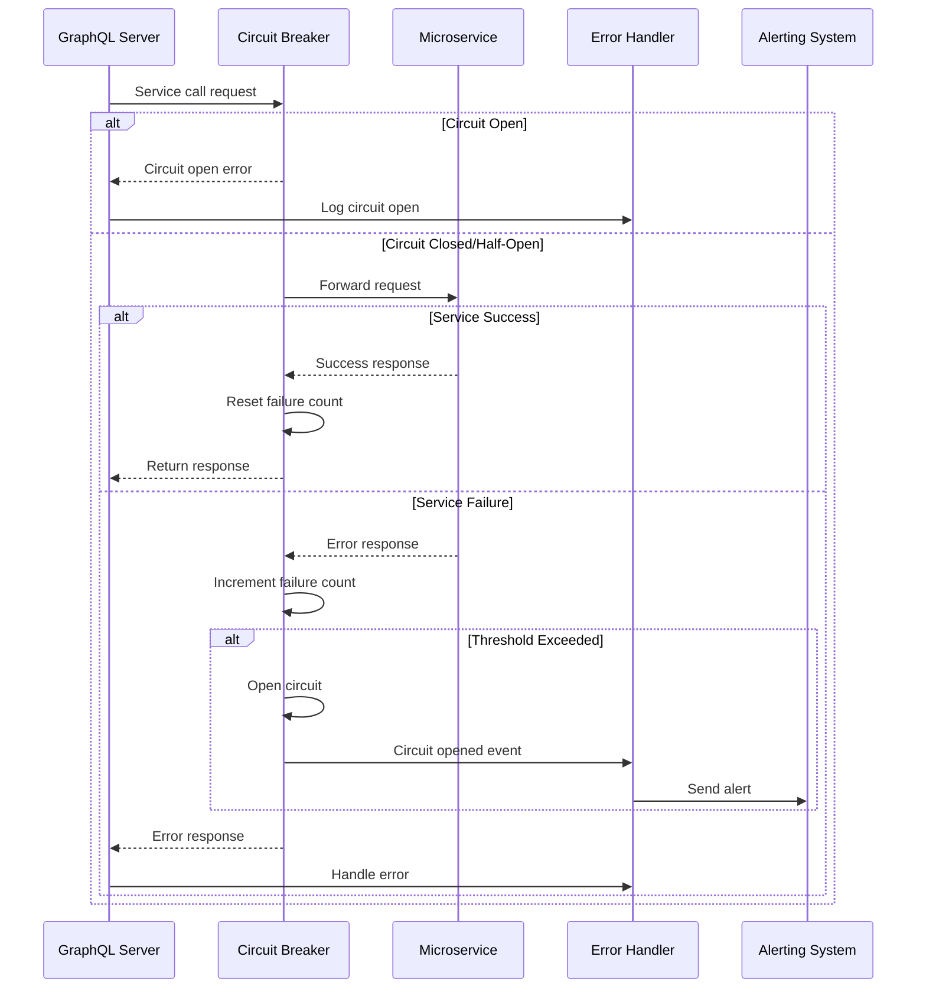
```mermaid
sequenceDiagram
    participant GraphQL as GraphQL Server
    participant CB as Circuit Breaker
    participant Service as Microservice
    participant Monitor as Error Handler
    participant Alert as Alerting System

    GraphQL->>CB: Service call request

    alt Circuit Open
        CB-->>GraphQL: Circuit open error
        GraphQL->>Monitor: Log circuit open
    else Circuit Closed/Half-Open
        CB->>Service: Forward request

        alt Service Success
            Service-->>CB: Success response
            CB->>CB: Reset failure count
            CB-->>GraphQL: Return response
        else Service Failure
            Service-->>CB: Error response
            CB->>CB: Increment failure count

            alt Threshold Exceeded
                CB->>CB: Open circuit
                CB->>Monitor: Circuit opened event
                Monitor->>Alert: Send alert
            end

            CB-->>GraphQL: Error response
            GraphQL->>Monitor: Handle error
        end
    end
```

## Cross-Chain Bridge Integration

### Bridge Transaction Flow

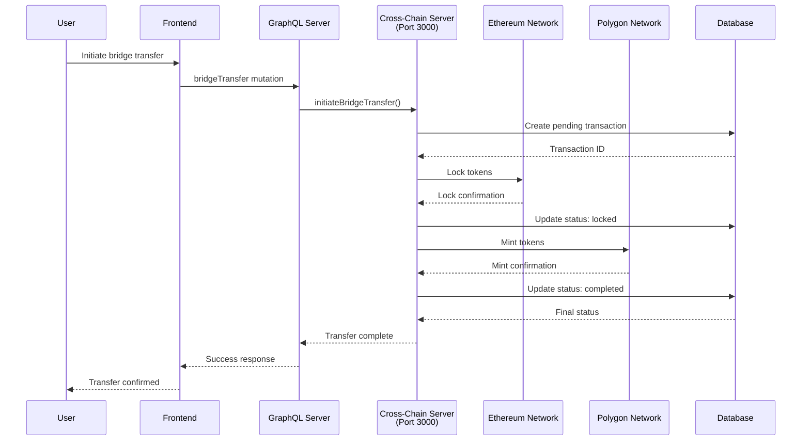
```mermaid
sequenceDiagram
    participant User
    participant Frontend
    participant GraphQL as GraphQL Server
    participant Bridge as Cross-Chain Server<br/>(Port 3000)
    participant Ethereum as Ethereum Network
    participant Polygon as Polygon Network
    participant DB as Database

    User->>Frontend: Initiate bridge transfer
    Frontend->>GraphQL: bridgeTransfer mutation
    GraphQL->>Bridge: initiateBridgeTransfer()

    Bridge->>DB: Create pending transaction
    DB-->>Bridge: Transaction ID

    Bridge->>Ethereum: Lock tokens
    Ethereum-->>Bridge: Lock confirmation

    Bridge->>DB: Update status: locked

    Bridge->>Polygon: Mint tokens
    Polygon-->>Bridge: Mint confirmation

    Bridge->>DB: Update status: completed
    DB-->>Bridge: Final status

    Bridge-->>GraphQL: Transfer complete
    GraphQL-->>Frontend: Success response
    Frontend-->>User: Transfer confirmed
```

### Bridge Monitoring & Health Checks

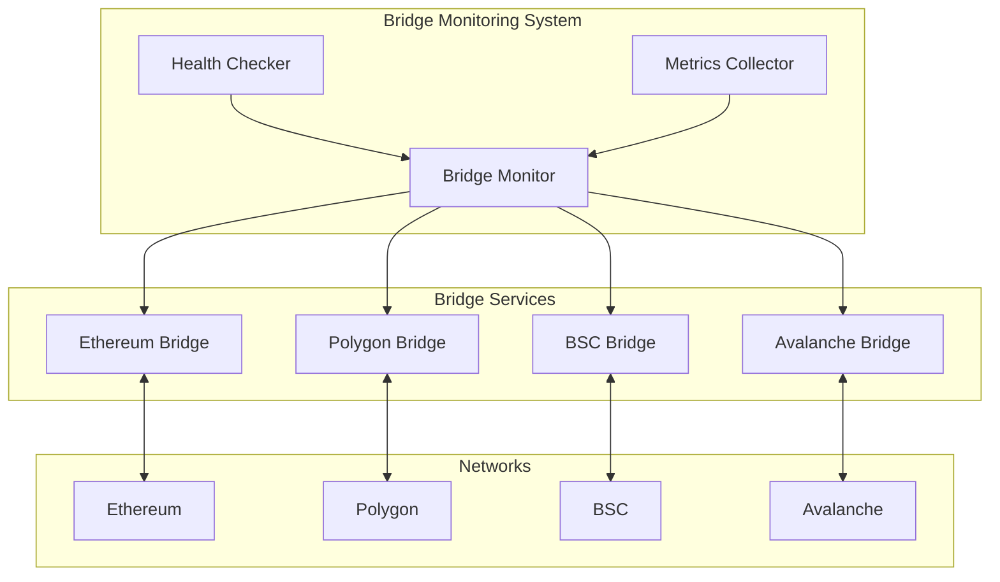
```mermaid
graph TB
    subgraph "Bridge Monitoring System"
        Monitor[Bridge Monitor]
        Health[Health Checker]
        Metrics[Metrics Collector]
    end

    subgraph "Bridge Services"
        EthBridge[Ethereum Bridge]
        PolBridge[Polygon Bridge]
        BSCBridge[BSC Bridge]
        AvaxBridge[Avalanche Bridge]
    end

    subgraph "Networks"
        ETH[Ethereum]
        MATIC[Polygon]
        BSC[BSC]
        AVAX[Avalanche]
    end

    Monitor --> EthBridge
    Monitor --> PolBridge
    Monitor --> BSCBridge
    Monitor --> AvaxBridge

    Health --> Monitor
    Metrics --> Monitor

    EthBridge <--> ETH
    PolBridge <--> MATIC
    BSCBridge <--> BSC
    AvaxBridge <--> AVAX
```

## Weather Data Processing Pipeline

### IoT Sensor Data Flow

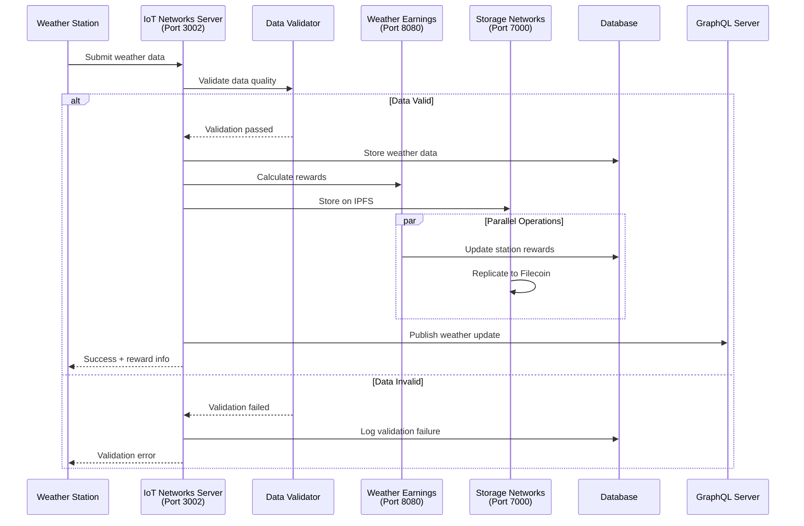
```mermaid
sequenceDiagram
    participant Sensor as Weather Station
    participant IoT as IoT Networks Server<br/>(Port 3002)
    participant Validate as Data Validator
    participant Rewards as Weather Earnings<br/>(Port 8080)
    participant Storage as Storage Networks<br/>(Port 7000)
    participant DB as Database
    participant GraphQL as GraphQL Server

    Sensor->>IoT: Submit weather data
    IoT->>Validate: Validate data quality

    alt Data Valid
        Validate-->>IoT: Validation passed
        IoT->>DB: Store weather data
        IoT->>Rewards: Calculate rewards
        IoT->>Storage: Store on IPFS

        par Parallel Operations
            Rewards->>DB: Update station rewards
            Storage->>Storage: Replicate to Filecoin
        end

        IoT->>GraphQL: Publish weather update
        IoT-->>Sensor: Success + reward info
    else Data Invalid
        Validate-->>IoT: Validation failed
        IoT->>DB: Log validation failure
        IoT-->>Sensor: Validation error
    end
```

### Computational NFT Processing

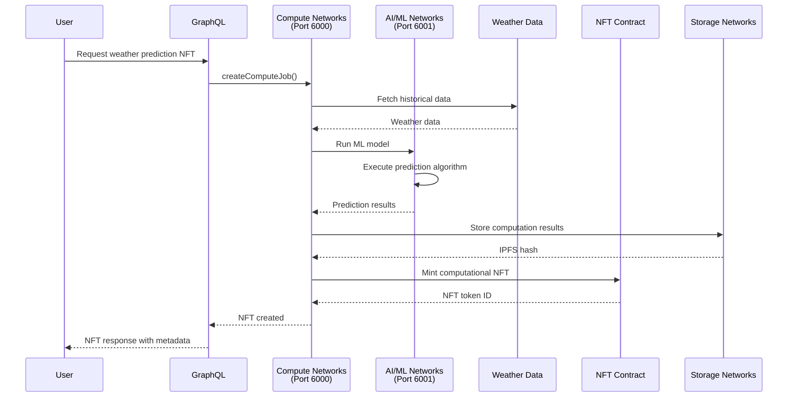
```mermaid
sequenceDiagram
    participant User
    participant GraphQL
    participant Compute as Compute Networks<br/>(Port 6000)
    participant AIML as AI/ML Networks<br/>(Port 6001)
    participant Weather as Weather Data
    participant NFT as NFT Contract
    participant IPFS as Storage Networks

    User->>GraphQL: Request weather prediction NFT
    GraphQL->>Compute: createComputeJob()

    Compute->>Weather: Fetch historical data
    Weather-->>Compute: Weather data

    Compute->>AIML: Run ML model
    AIML->>AIML: Execute prediction algorithm
    AIML-->>Compute: Prediction results

    Compute->>IPFS: Store computation results
    IPFS-->>Compute: IPFS hash

    Compute->>NFT: Mint computational NFT
    NFT-->>Compute: NFT token ID

    Compute-->>GraphQL: NFT created
    GraphQL-->>User: NFT response with metadata
```

## Database Integration Patterns

### Multi-Level Caching Architecture

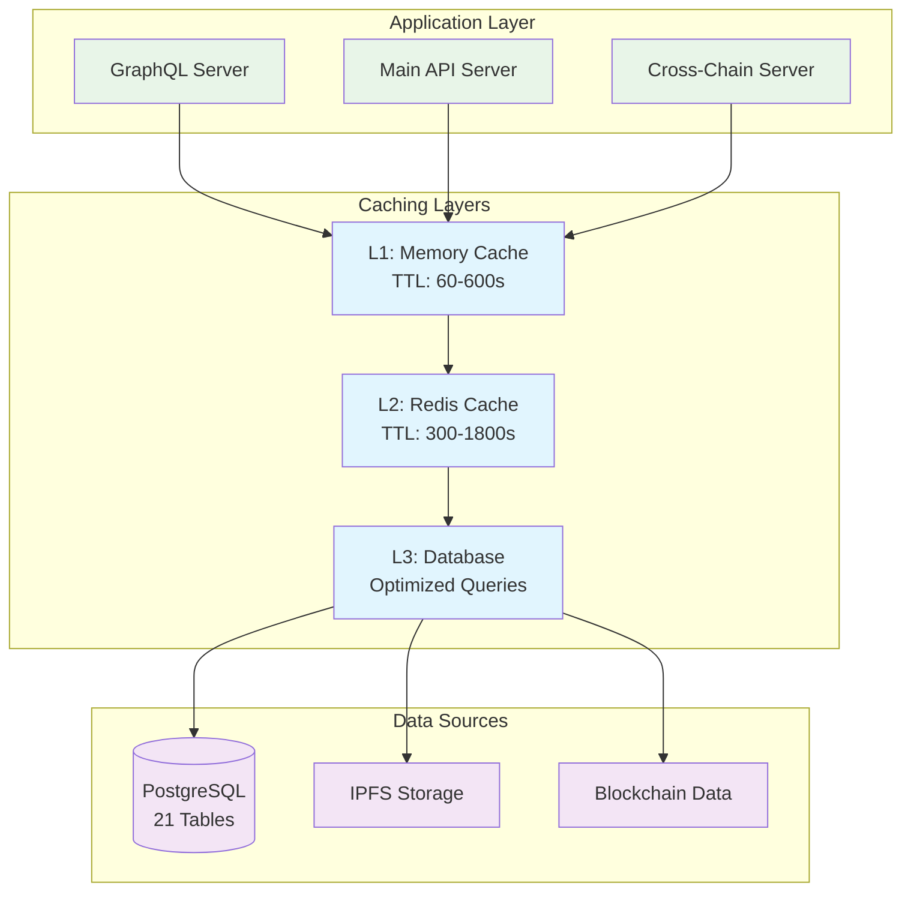
```mermaid
graph TB
    subgraph "Application Layer"
        App1[GraphQL Server]
        App2[Main API Server]
        App3[Cross-Chain Server]
    end

    subgraph "Caching Layers"
        L1[L1: Memory Cache<br/>TTL: 60-600s]
        L2[L2: Redis Cache<br/>TTL: 300-1800s]
        L3[L3: Database<br/>Optimized Queries]
    end

    subgraph "Data Sources"
        DB[(PostgreSQL<br/>21 Tables)]
        IPFS[IPFS Storage]
        Blockchain[Blockchain Data]
    end

    App1 --> L1
    App2 --> L1
    App3 --> L1

    L1 --> L2
    L2 --> L3
    L3 --> DB
    L3 --> IPFS
    L3 --> Blockchain

    classDef cache fill:#e1f5fe
    classDef storage fill:#f3e5f5
    classDef app fill:#e8f5e8

    class L1,L2,L3 cache
    class DB,IPFS,Blockchain storage
    class App1,App2,App3 app
```

### Database Transaction Flow

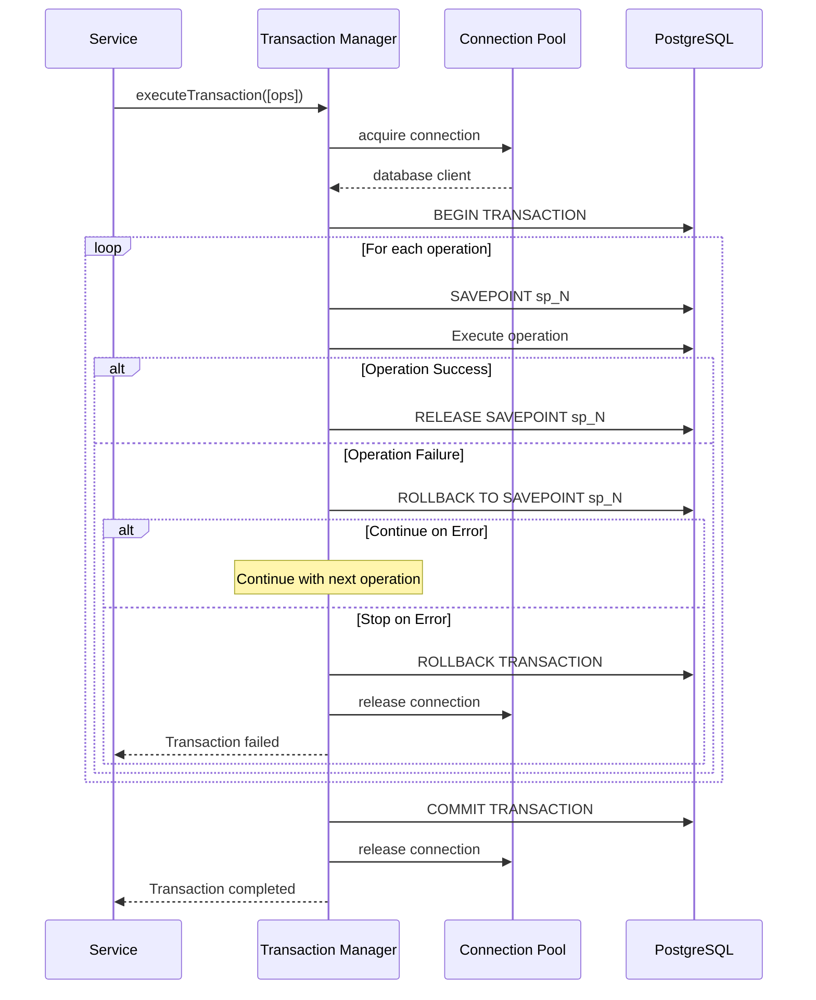
```mermaid
sequenceDiagram
    participant Service
    participant TxnMgr as Transaction Manager
    participant Pool as Connection Pool
    participant DB as PostgreSQL

    Service->>TxnMgr: executeTransaction([ops])
    TxnMgr->>Pool: acquire connection
    Pool-->>TxnMgr: database client

    TxnMgr->>DB: BEGIN TRANSACTION

    loop For each operation
        TxnMgr->>DB: SAVEPOINT sp_N
        TxnMgr->>DB: Execute operation

        alt Operation Success
            TxnMgr->>DB: RELEASE SAVEPOINT sp_N
        else Operation Failure
            TxnMgr->>DB: ROLLBACK TO SAVEPOINT sp_N

            alt Continue on Error
                Note over TxnMgr: Continue with next operation
            else Stop on Error
                TxnMgr->>DB: ROLLBACK TRANSACTION
                TxnMgr->>Pool: release connection
                TxnMgr-->>Service: Transaction failed
            end
        end
    end

    TxnMgr->>DB: COMMIT TRANSACTION
    TxnMgr->>Pool: release connection
    TxnMgr-->>Service: Transaction completed
```

## Governance System Integration

### Proposal Lifecycle

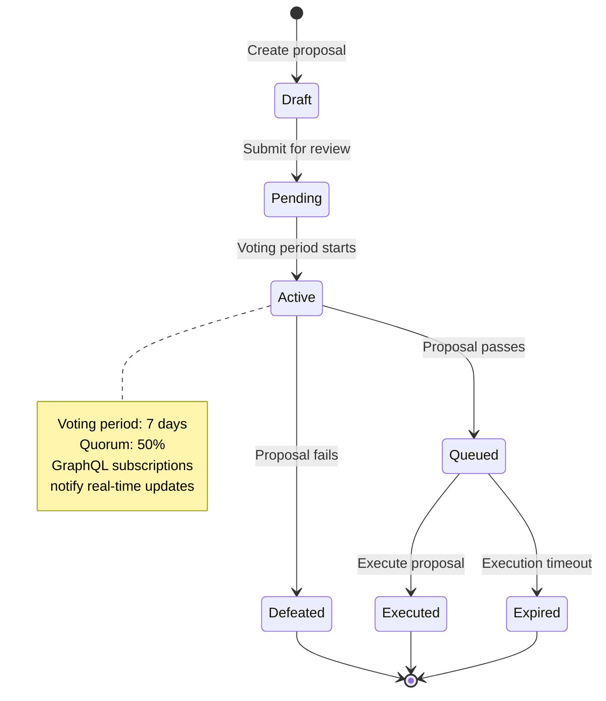
```mermaid
stateDiagram-v2
    [*] --> Draft: Create proposal
    Draft --> Pending: Submit for review
    Pending --> Active: Voting period starts
    Active --> Queued: Proposal passes
    Active --> Defeated: Proposal fails
    Queued --> Executed: Execute proposal
    Queued --> Expired: Execution timeout
    Defeated --> [*]
    Executed --> [*]
    Expired --> [*]

    note right of Active
        Voting period: 7 days
        Quorum: 50%
        GraphQL subscriptions
        notify real-time updates
    end note
```

### Governance Service Interactions

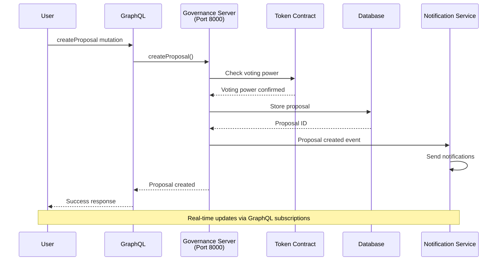
```mermaid
sequenceDiagram
    participant User
    participant GraphQL
    participant Gov as Governance Server<br/>(Port 8000)
    participant Token as Token Contract
    participant DB as Database
    participant Notify as Notification Service

    User->>GraphQL: createProposal mutation
    GraphQL->>Gov: createProposal()

    Gov->>Token: Check voting power
    Token-->>Gov: Voting power confirmed

    Gov->>DB: Store proposal
    DB-->>Gov: Proposal ID

    Gov->>Notify: Proposal created event
    Notify->>Notify: Send notifications

    Gov-->>GraphQL: Proposal created
    GraphQL-->>User: Success response

    Note over User,Notify: Real-time updates via GraphQL subscriptions
```

## Security Integration Points

### API Security Flow

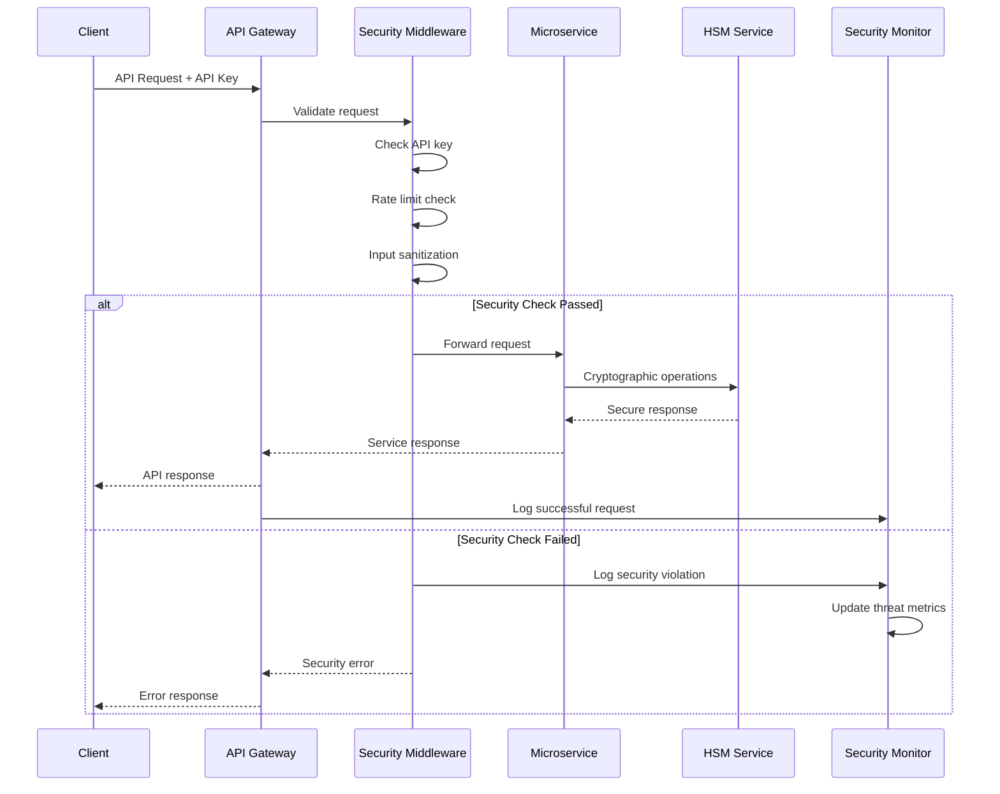
```mermaid
sequenceDiagram
    participant Client
    participant Gateway as API Gateway
    participant Auth as Security Middleware
    participant Service as Microservice
    participant HSM as HSM Service
    participant Monitor as Security Monitor

    Client->>Gateway: API Request + API Key
    Gateway->>Auth: Validate request

    Auth->>Auth: Check API key
    Auth->>Auth: Rate limit check
    Auth->>Auth: Input sanitization

    alt Security Check Passed
        Auth->>Service: Forward request
        Service->>HSM: Cryptographic operations
        HSM-->>Service: Secure response
        Service-->>Gateway: Service response
        Gateway-->>Client: API response

        Gateway->>Monitor: Log successful request
    else Security Check Failed
        Auth->>Monitor: Log security violation
        Monitor->>Monitor: Update threat metrics
        Auth-->>Gateway: Security error
        Gateway-->>Client: Error response
    end
```

### HSM Integration Architecture

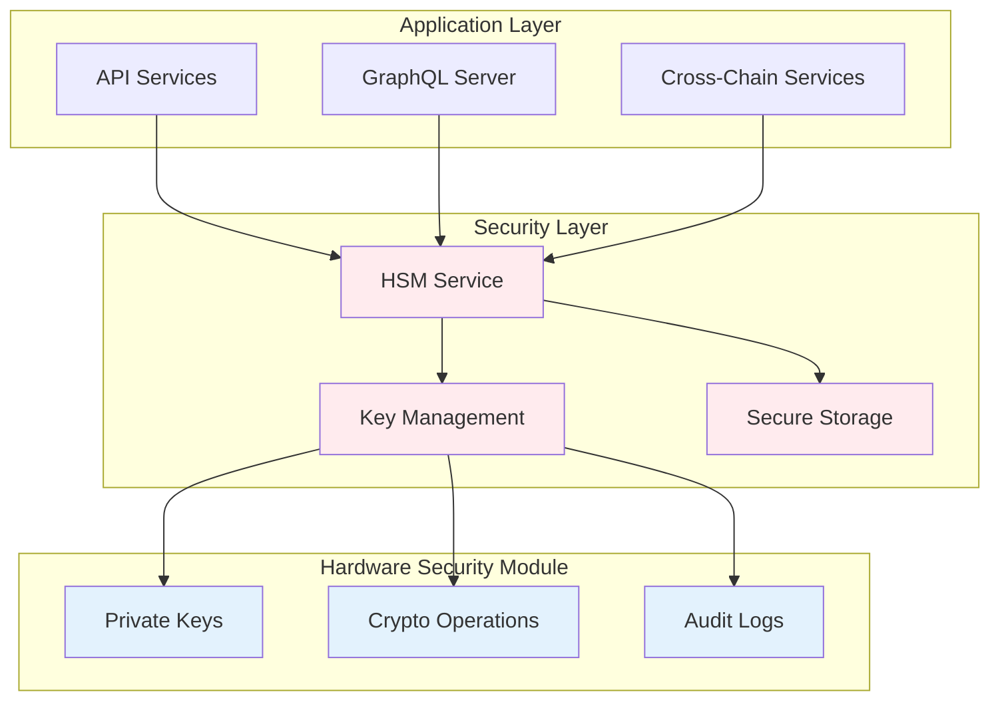
```mermaid
graph TB
    subgraph "Application Layer"
        API[API Services]
        GraphQL[GraphQL Server]
        Bridge[Cross-Chain Services]
    end

    subgraph "Security Layer"
        HSM[HSM Service]
        KeyMgmt[Key Management]
        SecStore[Secure Storage]
    end

    subgraph "Hardware Security Module"
        Keys[Private Keys]
        Crypto[Crypto Operations]
        Audit[Audit Logs]
    end

    API --> HSM
    GraphQL --> HSM
    Bridge --> HSM

    HSM --> KeyMgmt
    HSM --> SecStore

    KeyMgmt --> Keys
    KeyMgmt --> Crypto
    KeyMgmt --> Audit

    classDef security fill:#ffebee
    classDef hardware fill:#e3f2fd

    class HSM,KeyMgmt,SecStore security
    class Keys,Crypto,Audit hardware
```

## Performance Monitoring Architecture

### Metrics Collection Flow

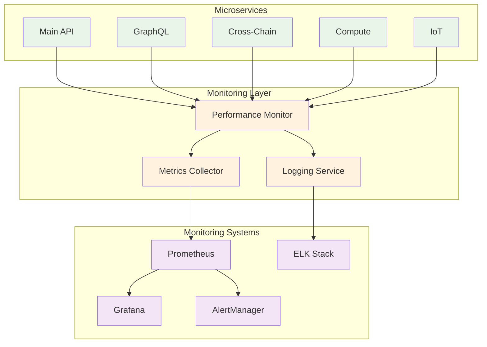
```mermaid
graph TB
    subgraph "Microservices"
        MS1[Main API]
        MS2[GraphQL]
        MS3[Cross-Chain]
        MS4[Compute]
        MS5[IoT]
    end

    subgraph "Monitoring Layer"
        PM[Performance Monitor]
        Metrics[Metrics Collector]
        Logger[Logging Service]
    end

    subgraph "Monitoring Systems"
        Prometheus[Prometheus]
        Grafana[Grafana]
        ELK[ELK Stack]
        Alert[AlertManager]
    end

    MS1 --> PM
    MS2 --> PM
    MS3 --> PM
    MS4 --> PM
    MS5 --> PM

    PM --> Metrics
    PM --> Logger

    Metrics --> Prometheus
    Logger --> ELK

    Prometheus --> Grafana
    Prometheus --> Alert

    classDef service fill:#e8f5e8
    classDef monitor fill:#fff3e0
    classDef external fill:#f3e5f5

    class MS1,MS2,MS3,MS4,MS5 service
    class PM,Metrics,Logger monitor
    class Prometheus,Grafana,ELK,Alert external
```

### Real-Time Performance Tracking

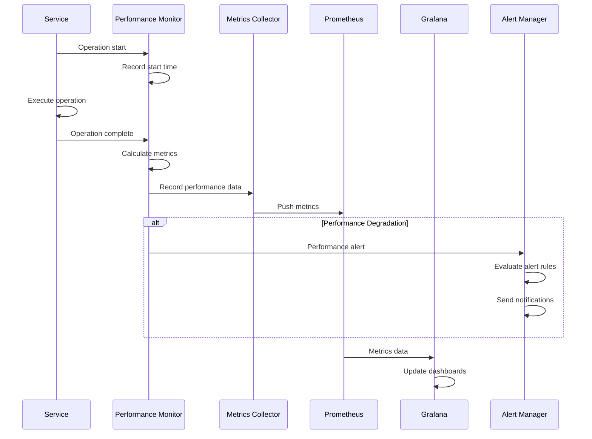
```mermaid
sequenceDiagram
    participant Service
    participant Monitor as Performance Monitor
    participant Metrics as Metrics Collector
    participant Prometheus
    participant Grafana
    participant Alert as Alert Manager

    Service->>Monitor: Operation start
    Monitor->>Monitor: Record start time

    Service->>Service: Execute operation

    Service->>Monitor: Operation complete
    Monitor->>Monitor: Calculate metrics

    Monitor->>Metrics: Record performance data
    Metrics->>Prometheus: Push metrics

    alt Performance Degradation
        Monitor->>Alert: Performance alert
        Alert->>Alert: Evaluate alert rules
        Alert->>Alert: Send notifications
    end

    Prometheus->>Grafana: Metrics data
    Grafana->>Grafana: Update dashboards
```

## Deployment and Service Discovery

### Container Orchestration

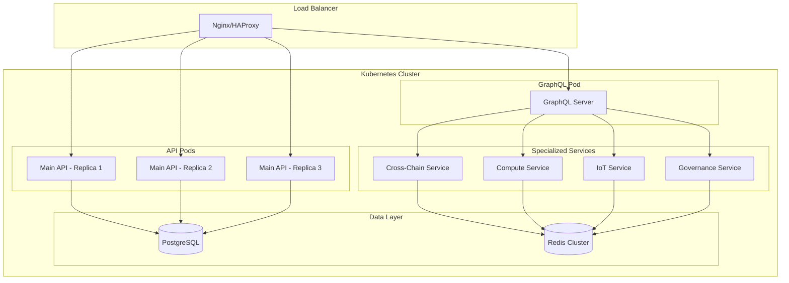
```mermaid
graph TB
    subgraph "Load Balancer"
        LB[Nginx/HAProxy]
    end

    subgraph "Kubernetes Cluster"
        subgraph "GraphQL Pod"
            GraphQL[GraphQL Server]
        end

        subgraph "API Pods"
            API1[Main API - Replica 1]
            API2[Main API - Replica 2]
            API3[Main API - Replica 3]
        end

        subgraph "Specialized Services"
            Bridge[Cross-Chain Service]
            Compute[Compute Service]
            IoT[IoT Service]
            Gov[Governance Service]
        end

        subgraph "Data Layer"
            PG[(PostgreSQL)]
            Redis[(Redis Cluster)]
        end
    end

    LB --> GraphQL
    LB --> API1
    LB --> API2
    LB --> API3

    GraphQL --> Bridge
    GraphQL --> Compute
    GraphQL --> IoT
    GraphQL --> Gov

    API1 --> PG
    API2 --> PG
    API3 --> PG

    Bridge --> Redis
    Compute --> Redis
    IoT --> Redis
    Gov --> Redis
```

### Service Discovery and Health Monitoring

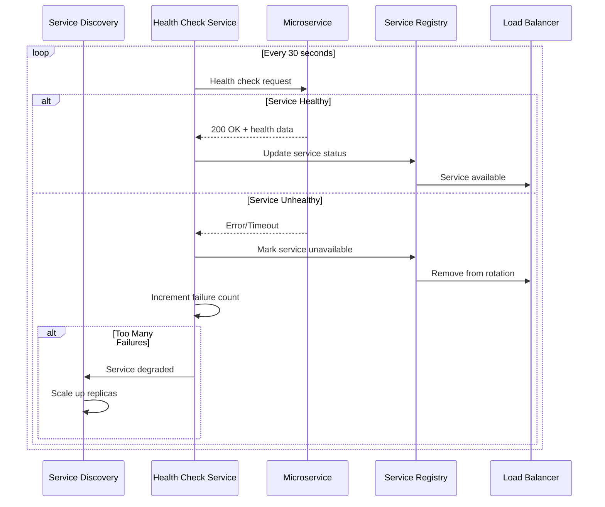
```mermaid
sequenceDiagram
    participant SD as Service Discovery
    participant Health as Health Check Service
    participant Service as Microservice
    participant Registry as Service Registry
    participant LB as Load Balancer

    loop Every 30 seconds
        Health->>Service: Health check request

        alt Service Healthy
            Service-->>Health: 200 OK + health data
            Health->>Registry: Update service status
            Registry->>LB: Service available
        else Service Unhealthy
            Service-->>Health: Error/Timeout
            Health->>Registry: Mark service unavailable
            Registry->>LB: Remove from rotation
            Health->>Health: Increment failure count

            alt Too Many Failures
                Health->>SD: Service degraded
                SD->>SD: Scale up replicas
            end
        end
    end
```

## Event-Driven Architecture

### Pub/Sub Message Flow

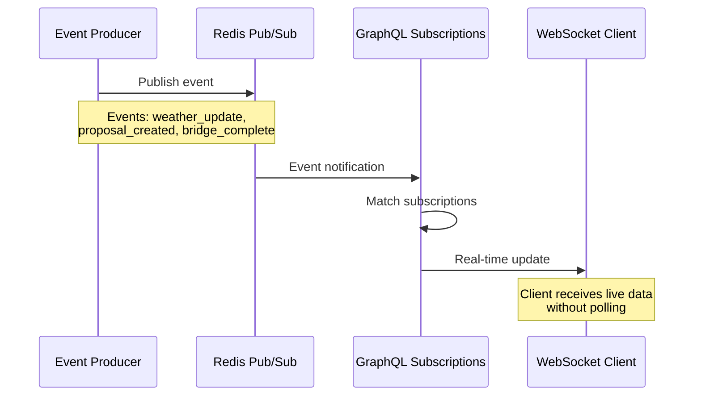
```mermaid
sequenceDiagram
    participant Producer as Event Producer
    participant PubSub as Redis Pub/Sub
    participant GraphQL as GraphQL Subscriptions
    participant Client as WebSocket Client

    Producer->>PubSub: Publish event
    Note over Producer,PubSub: Events: weather_update,<br/>proposal_created, bridge_complete

    PubSub->>GraphQL: Event notification
    GraphQL->>GraphQL: Match subscriptions
    GraphQL->>Client: Real-time update

    Note over Client: Client receives live data<br/>without polling
```

### Event Types and Routing

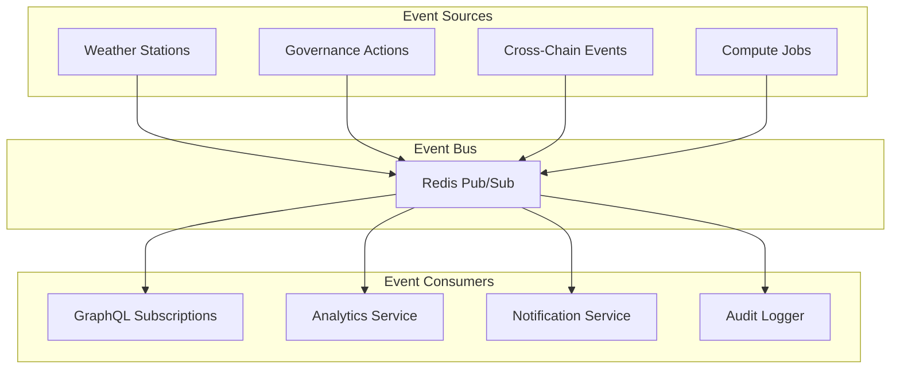
```mermaid
graph TB
    subgraph "Event Sources"
        Weather[Weather Stations]
        Gov[Governance Actions]
        Bridge[Cross-Chain Events]
        Compute[Compute Jobs]
    end

    subgraph "Event Bus"
        PubSub[Redis Pub/Sub]
    end

    subgraph "Event Consumers"
        GraphQL[GraphQL Subscriptions]
        Analytics[Analytics Service]
        Notifications[Notification Service]
        Audit[Audit Logger]
    end

    Weather --> PubSub
    Gov --> PubSub
    Bridge --> PubSub
    Compute --> PubSub

    PubSub --> GraphQL
    PubSub --> Analytics
    PubSub --> Notifications
    PubSub --> Audit
```

---

## Integration Testing Patterns

### End-to-End Test Flow

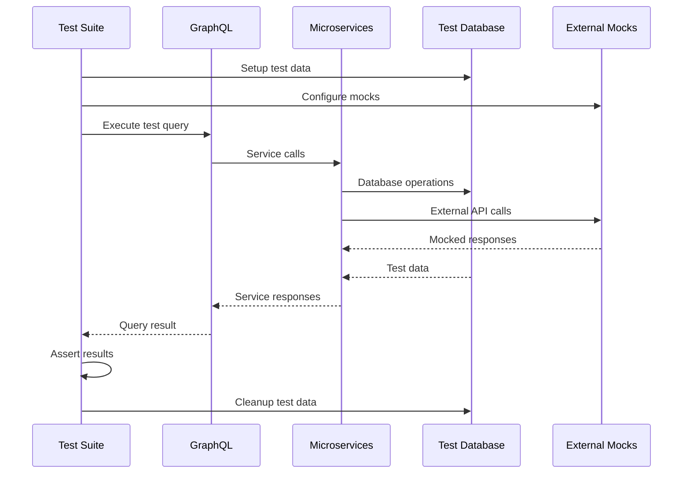
```mermaid
sequenceDiagram
    participant Test as Test Suite
    participant GraphQL
    participant Services as Microservices
    participant DB as Test Database
    participant Mock as External Mocks

    Test->>DB: Setup test data
    Test->>Mock: Configure mocks

    Test->>GraphQL: Execute test query
    GraphQL->>Services: Service calls
    Services->>DB: Database operations
    Services->>Mock: External API calls

    Mock-->>Services: Mocked responses
    DB-->>Services: Test data
    Services-->>GraphQL: Service responses
    GraphQL-->>Test: Query result

    Test->>Test: Assert results
    Test->>DB: Cleanup test data
```

This comprehensive set of component interaction diagrams illustrates the complex relationships and
data flows within the WRFCoin platform, providing backend development agents with clear visual
guidance for implementing and integrating new services within the existing architecture.
